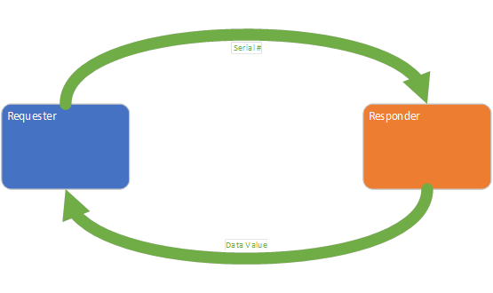
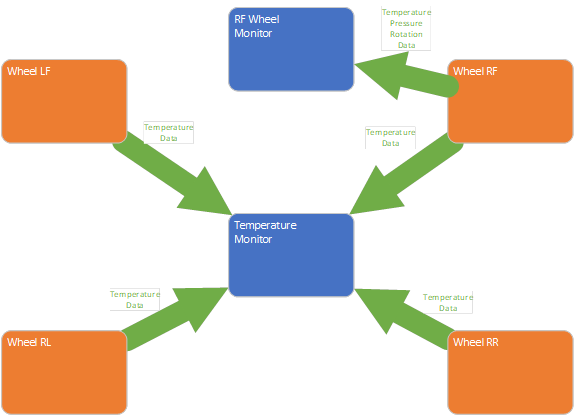
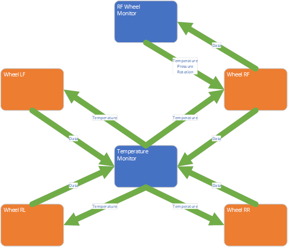
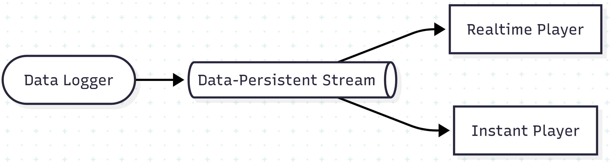
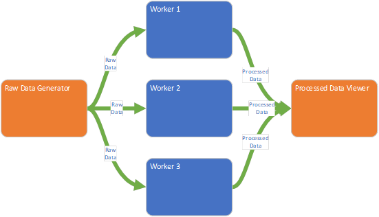

# RFC: Messaging Systems Evaluation Framework

Author: John Dwyer, Cyril Bouton
:revdate: 2025-04-22
:toc:
:toclevels: 3

## 1. Introduction

This RFC outlines a standardized evaluation framework for assessing candidate messaging technologies for the **Testman NextGen Platform**. The evaluation aims to assess message-oriented architectures based on practical application scenarios and objective performance criteria.

## 2. Candidate Technologies

* RabbitMQ
* ZeroMQ
* NATS (JetStream)

## 3. Evaluation Criteria

Each candidate will be scored on the following categories:

- Ease of implementation
- Ease of maintenance
- Performance
- Latency (end-to-end)
- Reliability
- Scalability (horizontal/vertical)
- Cost
- Deployment Effort
- Throughput (msgs/sec, MB/sec)
- Durability and Persistence
- Resource Utilization (CPU, RAM, disk, network)
- Failure Recovery

## 4. Programming Language Scope

==All implementations in this round will use C#==. Future evaluations will include language interoperability (e.g., C++, LabVIEW, etc.).

## 5. Test Environment

- Real OS/VMs/containers ?
- If possible, homogeneous nodes (e.g., 4 vCPU, 8 GB RAM, SSD)
- Same OS and kernel settings across tests.

## 6. Messaging Scenarios

Each scenario must be implemented for each technology under test and are presented in deliberately general terms, then in a more specific use case, and finally in a diagram form

### 6.1 Simple Publish-Subscribe

a. A single subscriber registers with a single publisher to receive updates for a specific message topic selected from multiple available topics.

b. The publisher transmits individual data values, each tagged with a distinct serial number. These data values vary randomly and are updated at a frequency of once per second. The subscriber monitors data associated with one specific serial number and presents the received data on a chart.

### 6.2 Simple Request-Response

a. A single requester submits a query to a single responder and displays the received response.

b. The responder returns data upon receiving a request from the requester. Each request includes a serial number, and the responder replies with the current data value associated with that serial number. The responder maintains and updates data for multiple serial numbers at a rate of once per second. It must also be capable of handling requests for serial numbers that do not exist. The requester visualizes the returned data on a chart.

### 6.3 Simple Stream

a. A single logging entity maintains a list of log messages, and a single consumer registers to receive the current contents of the log along with any subsequent updates.

b. The logger continuously records access attempts to a simulated system. Each log entry includes, at a minimum, the username, timestamp, and the success or failure status of the attempt. A consumer connects to the logger, displays all existing log entries, and periodically refreshes to incorporate any new entries.

### 6.4 Complex Publish-Subscribe

a. Two subscriber entities each register with two or more distinct publisher entities to receive different message topics. The model must include a scenario where both subscribers register with the same publisher, as well as a scenario where a single subscription accesses data from two different publishers.

b. Each publisher emits messages for three distinct measurement topics associated with a single car wheel: temperature, pressure, and rotational speed (where positive values indicate forward motion, zero indicates a stationary state, and negative values indicate reverse motion). There are four publishers in total, each responsible for one of the car's four wheels. These measurements are updated once per second. Two subscribers consume this data: one displays temperature readings from all wheels, while the other displays all available measurements for a single selected wheel.

### 6.5 Complex Request-Response

a. Two requester entities each issue queries to two or more distinct responder entities and display the corresponding responses. The model must include a scenario in which both requesters submit requests to the same responder, as well as a scenario in which a single requester submits requests to multiple responders.

b. Each responder provides data for three distinct measurements associated with a single car wheel: temperature, pressure, and rotational speed (with positive values indicating forward motion, zero indicating a stationary state, and negative values indicating reverse motion). Each measurement is obtained through an individual request. There are four responders in total, each responsible for handling requests related to one of the four wheels. The data values are updated once per second. Two requesters consume this data: one retrieves and displays only the temperature values for all four wheels, while the other retrieves and displays all measurement data for a single selected wheel

### 6.6 Complex Stream

a. A single data-logging entity maintains a persistent stream of data points. Multiple consumer entities register to receive data from the logger, each with distinct consumption behavior. One consumer plays back the data stream, updating in real time at the original data acquisition rate. A second consumer displays the entire data stream contents as quickly as possible.

### 6.7 Worker Pool

a. A single message-generating entity produces a continuous stream of messages. These messages are distributed among a pool of worker entities that process them concurrently. The results produced by the worker pool are then gathered and presented by a separate collection entity.

b. A data generator emits data value messages, which are forwarded to a worker pool for parallel processing. Each worker performs a processing operation on the data and then submits the result to a collecting entity. The collector displays the processed data on a chart. The processing logic should be designed to simulate varying levels of computational complexity—for example, by incorporating sleep statements to emulate differing workloads.

## 7. Benchmarking Tests

### 7.1 Latency Test

- Measure time from publish to receive
- Vary message sizes: 1KB, 10KB, 100KB, 1000KB,...
- Test in-memory and persisted modes (if applicable and depending on technology)
- Report P50, P95, P99 latency https://medium.tuanh.net/statistics-behind-latency-metrics-understanding-p90-p95-and-p99-28516ec372e5

### 7.2 Throughput Test

- Fixed number of producers/consumers
- Ramp up message rate
- Capture peak stable throughput

### 7.3 Request/Reply (REQ/REP) Pattern

- Simulate requestors and responders (e.g., RPC)
- Measure round-trip time (RTT)
- Test under concurrent load and with delayed responses
- Analyze timeout and retry behavior

### 7.4 Persistence & Durability

- Evaluate where supported (e.g., RabbitMQ, NATS JetStream)
- Test broker restarts, client reconnects, and disk pressure scenarios

### 7.5 Fault Tolerance

- Kill brokers or simulate network loss
- Observe message recovery and reconnection behavior
- Measure Recovery Time Objective (RTO) and message loss

### 7.6 Scalability

- Increase brokers (if applicable)
- Scale clients (1 → N producers/consumers)
- Note saturation points and scalability characteristics

### 7.7 Operational Complexity

- Deploy and configure clusters
- Setup TLS, AuthN/AuthZ
- Perform rolling upgrades
- Measure time-to-setup and time-to-recover

## 8. Metrics and KPIs

| Metric                  | Description                               |
| ----------------------- | ----------------------------------------- |
| Latency (P50, P95, P99) | End-to-end message delay                  |
| Throughput              | Msg/sec and MB/sec                        |
| Request/Reply RTT       | Round-trip time of REQ/REP interactions   |
| Delivery Guarantees     | At-most-once, at-least-once, exactly-once |
| Resource Utilization    | CPU, memory, disk I/O, network usage      |
| Recovery Time Objective | Time to recover from failure              |
| Message Loss Rate       | Lost messages under failure or load       |
| Operational Time        | Time to deploy, monitor, scale, secure    |

## 9. Reporting & Deliverables

* Dashboards
* Benchmark outputs
* Comparison Matrix (latency, throughput, ops effort)
* Final Recommendations
* Decision Matrix by Use Case

