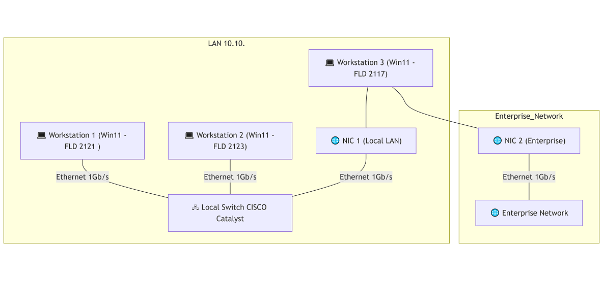
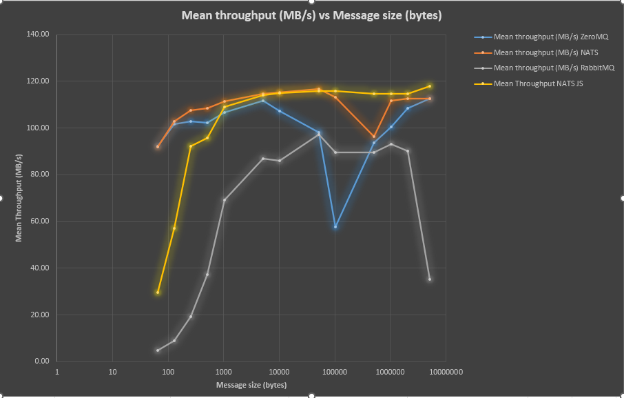
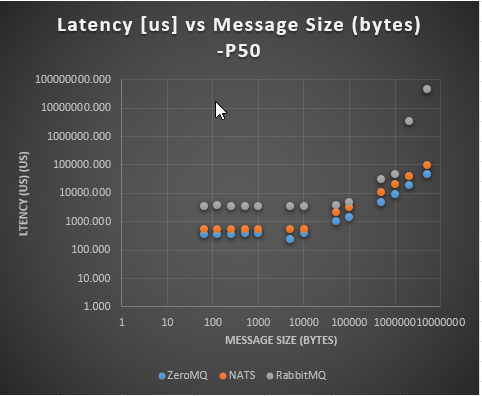
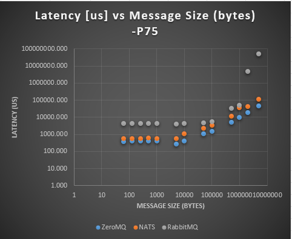
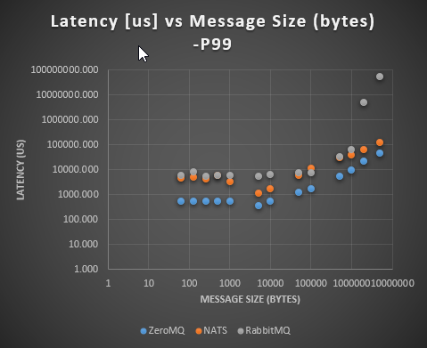

# Assessment Report: 0001_20250422_Messaging_System RFC

* Author: Cyril Bouton  
* revdate: 2025-07-07


## 1. Executive Summary

We compared four messaging technologies—ZeroMQ, NATS Core, NATS JetStream, and RabbitMQ—under similar test conditions (1 Gb/s link, Same B message payloads).  
  
NATS Core delivered sub-millisecond latencies (~500 µs for messages under 100KB) and ~110 MB/s throughput, while NATS JetStream added persistence with ~0.5–1 ms latencies and ~100 MB/s throughput. 

This report demonstrates why combining **NATS Core** for real-time, low-latency traffic and **NATS JetStream** for durable streaming offers the optimal balance of performance and reliability for the Next GEN Platform architecture.

## 2. Background & Objectives

- **Objective:** Identify a messaging platform that simultaneously:
  1. **Minimizes latency** for real-time messaging
  2. **Maximizes throughput** for high-volume streams
  3. **Provides durability** and replay capabilities
  4. **Durability & Persistence**
  5. **Scalability** (horizontal and vertical)
  6. **Operational Complexity**  
  7. **Resource Utilization** (CPU, memory, disk, network)  
  8. **Failure Recovery**  
  9. **Request/Reply Performance** (REQ/REP pattern)


- **Technologies considered:**
  - **NATS Core:** Lightweight brokered pub/sub
  - **NATS JetStream:** Persistence layer atop NATS Core
  - **ZeroMQ:** Brokerless, ultra-low-latency
  - **RabbitMQ:** Full AMQP broker with durability

## 3. Test Setup for Latency & Throughput Benchmarking

In this document we are using the decimal definition of “megabyte” (1 MB = 10⁶ bytes) since network link rates are almost always specified in decimal units.

- **Environment:** Three WIN 11 Stations, 1 Gb/s NICs on an isolated switch CISCO Catalyst serie.  

[Setup Document](assets/Links/Messaging_Protocols_Fld_Information.docx)

- **Payload sizes:** 64, 128, 256, 512, 1024, 5120, 10240, 51200,102400, 512000, 1204000, 2048000, 5120000 bytes.
- **Message count:** variable per payload to keep under Gb limit.
- **Clients:** 1 publisher/producer, 1 subscriber/responder.
- **Storage:**
  - **Core & JetStream (memory):** for peak throughput
  - **JetStream (file-store) with 10 s `sync_interval`:** for durability tests
  

Instructions/customized code on how those tests were conducted are available at:
* [NATS_Benchmarking DSE Github Repo](https://github.apps.gevernova.net/GP-ENG-MECH/NATS_Benchmarking)  
* [ZeroMQ_Benchmarking DSE Github Repo](https://github.apps.gevernova.net/GP-ENG-MECH/ZeroMQ_Benchmarking)  
* [RabbitMQ_Benchmarking DSE Github Repo](https://github.apps.gevernova.net/GP-ENG-MECH/RabbitMQ_Benchmarking)  

## 4. Measured Results

### 4.1 Throughput by technology

- Nats Server and RabbitMQ server on FLD2117
- 1 Producer on FLD2121
- 1 Consumer on FLD2123
- Fixed number of producers/consumers
- Ramp up message rate



### 4.2 Latency

- Nats Server and RabbitMQ server on FLD2117
- RTT between FLD2121 & FLD2123
- Ramp up message rate
- P50 (Median, P75 and P99)





### 4.3 Results Table

| Technology         | Median Latency       | Throughput (MB/s) | Comments                                            |
|--------------------|----------------------|-------------------|-----------------------------------------------------|
| **NATS Core**      | ~500-2000 us (payload < 1MB)          | ~92-110 MB/s         | Single-hop pub/sub, no persistence overhead (FLD2117 - Single NATS Server )       |
| **NATS JetStream** |         | ~30–110 MB/s       | Memory store - Disk persistence benchmarking tot be conducted on more performant SSD
| ZeroMQ             | ~300-1000 µs (payload < 1MB)           | ~93-110 MB/s         | Brokerless, but lacks built-in persistence FLD2121 to FLD2123 direct          |
| RabbitMQ           | ~3–5 ms              | ~4–95 MB/s       | AMQP framing + durable queues add significant overhead (FLD2117 - Single NATS Server)|

## 5. Study of Real Case Message format 

The data acquired from a producer consists of: 
- a timestamp
- 3 arrays of 40 values (peak,phase, amplitude).
- 128 channels, each producing 3 arrays of 40 values
and is pushed every 100 ms as a message.

## 5.1 JSON

```json
 {
   "timestamp_ns": 1730006400000000000,
   "node": "A12",
   "channel": 7,
   "peak":      [0.123, 0.117, …, 0.102],    // 40 floats
   "phase":     [1.570, 1.540, …, 1.490],    // 40 floats
   "amplitude": [0.045, 0.043, …, 0.038]     // 40 floats
}
```

Estimated size:
+ Field names & punctuation ≈ 200 B
+ 120 numbers (~8 chars each + commas) ≈ 1 000 B
+ **Total ≈ 1.2 KB** (can swell to ~1.5 KB if you include whitespace/indentation)

## 5.2 Fixed-layout binary (little-endian)

|  Offset |  Size | Field                       |
| :-----: | :---: | :-------------------------- |
|    0    |  8 B  | int64 timestamp\_ns         |
|    8    |  2 B  | uint16 node\_id (e.g. index) |
|    10   |  2 B  | uint16 reserved/version      |
|    12   | 160 B | float32 peak\[40]           |
|   172   | 160 B | float32 phase\[40]          |
|   332   | 160 B | float32 amplitude\[40]      |
| **492** |       | **TOTAL: 492 bytes**        |

> Peak/phase/amp blocks were collapsed into 3×160 B here because float32 is 4 bytes × 40 samples. Total is ~490 B per message.

- **Timestamp** as int64 ns gives you nanosecond precision, easy to slice in a storage Database if needed.
- **uint16** Channel ID lets you address up to 65536 channels.
- Three consecutive blocks of 40 float32’s keeps your publisher’s memory layout linear

## 5.3 Protobufs

For schema evolution, language‐agnostic clients, or automatic code‐generation:

```proto
syntax = "proto3";
message ChannelSnapshot {
  int64 timestamp_ns = 1;         // nanoseconds since epoch
  uint32 channel_id   = 2;        // 0…127
  repeated float peak  = 3 [packed=true];     // len = 40
  repeated float phase = 4 [packed=true];     // len = 40
  repeated float amp   = 5 [packed=true];     // len = 40
}
```

- Protobuf’s packed floats will end up being ~4 bytes each, so your serialized payload is ~810–840 bytes.
- Auto-generated serializers/deserializers in Python, C#, etc.


**Predictable size (~800 B)** at 10 Hz × 128 ch → ≈1 MB/s, easy to transport according to previous benchmarks.

## 6. Analysis of Latency & Throughput Results

1. **Latency Requirements**  
   - **Real-time control:** Sub-millisecond round-trip times are critical for control-plane signals (e.g., start recording, Triggers, ..).  
   - **NATS Core** consistently stays in the 0.5–2 ms range. Ideal for this use case.

2. **Throughput Needs**  
   - **High-volume telemetry:** Bulk data ingestion (e.g., logs, metrics) benefits from sustained ~110 MB/s+.  
   - **JetStream (memory store)** achieves ≈110 MB/s; acceptable given its added durability.

3. **Operational Simplicity**  
   - **Unified platform:** Both Core and JetStream use the same NATS server binary and CLI, reducing operator overhead.  
   - **Scalability:** NATS clusters seamlessly route Core and JetStream traffic together.

## 7. Recommendation

Adopt a **hybrid messaging architecture** using:
- **NATS Core** for low-latency, transient message flows (control signals, heartbeats).
- **NATS JetStream** for durable, replayable streams (metrics, audit logs, event sourcing).

**Key benefits:**
- **Lowest latency** where it matters—Core’s 0.5 ms RTT.
- **High throughput** on durable streams—JetStream’s ~70 MB/s with file-store sync tuning.
- **Single operational stack**, leveraging one binary, one security model, one clustering framework.

## 8. Other Additional Advantages Over ZeroMQ and RabbitMQ

Beyond throughput and latency, the combined NATS Core + JetStream solution offers operational and feature advantages over ZeroMQ and RabbitMQ:

1. **Built‑in Persistence and Replay**

   * **JetStream** provides at‑least‑once delivery semantics, durable storage, and consumer replay capabilities.
   * ZeroMQ lacks any built‑in persistence; you must layer your own persistence or risk message loss on process failures.
   * RabbitMQ provides persistence but requires explicit queue and exchange configuration, and replay logic typically involves complex backlog management.

2. **Simple Clustering and Scaling**

   * **NATS clusters** form with zero coordination services—just configure `routes` in each server’s config.
   * Leaf nodes and gateways extend the mesh across data centers with minimal overhead.
   * RabbitMQ clustering often requires additional Erlang cookie management, complex partition handling, and maintenance of mirrored queues.

3. **Lightweight Operational Footprint**

   * NATS’s single-binary design and simple configuration reduce operational complexity.
   * ZeroMQ requires embedding or managing separate broker processes if you want a brokered topology.
   * RabbitMQ’s Erlang runtime, plugins, and additional management components increase resource usage and upgrade complexity.

4. **Unified Security Model**

   * NATS leverages JWT-based accounts, users, and granular permissions (publish/subscribe) in a single operator scope.
   * ZeroMQ’s security is pluggable (CurveZMQ) but must be hand‑wired per socket.
   * RabbitMQ’s user/password and plugin‑based ACL model is powerful but scattered across multiple config files and management interfaces.

5. **Extensible API and Protocol**

   * The **NATS protocol** is compact and easy to extend. The work done to validate design patterns in C# per rfc guidelines is proff of that. 
   * JetStream APIs allow stream management, consumer control, and monitoring via the same `nats` CLI or SDK.
   * RabbitMQ’s AMQP 0‑9‑1 is feature‑rich but verbose; RabbitMQ management plugin APIs are separate REST endpoints.

6. **Rich Observability**

   * NATS exposes `/varz`, `/connz`, `/routez`, and `/jsz` HTTP endpoints for real‑time metrics.
   * Built‑in HDR histograms for latency, pluggable exporter integrations (Prometheus, OpenTelemetry).
   * RabbitMQ relies on plugin‑provided metrics and custom dashboards; ZeroMQ has no native observability.

7. **Built-in Key-Value and Object Stores**

   * JetStream KV provides a simple, watchable, strongly consistent key-value API on top of streams.
   * Object Store support allows storing files/blobs with automated chunking, versioning, and direct retrieval via the NATS protocol.
   * These high-level abstractions simplify common distributed patterns (configuration distribution, feature flags, shared state) without needing an external database or additional services.
   
8. **End-to-End Encryption**

	* NATS supports TLS for all client-server, server-server, and route communications, ensuring data in transit is encrypted.
	* JetStream can be configured with server-side encryption at rest (via cipher options), protecting stored messages and KV entries.
	* Unlike ZeroMQ (which requires manual socket-level encryption) and RabbitMQ (which often relies on external TLS configs and plugins), NATS provides a unified, easy-to-configure encryption model.

## 8. Next Steps

1. **Pilot deployment:** Spin up a small NATS cluster with JetStream enabled; exercise both Core and JetStream paths.
2. **End-to-end testing:** Validate application-level behaviors (failover, replay, backpressure).
3. **Monitoring & tuning:** Use NATS’ `/varz` and `/jsz` endpoints to observe real-world latencies and throughput, then adjust `sync_interval`, client concurrency, and storage tiers as needed.

**Conclusion:** By combining NATS Core’s sub-millisecond latency with JetStream’s durable streaming at \~70 MB/s, you achieve a messaging stack that meets both performance and reliability requirements while minimizing operational complexity.


