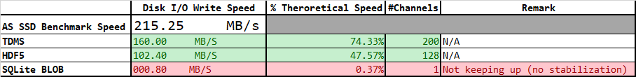

# RFC: File Format evaluation for next gen Platform - Raw/Edge Storage

+ Author: Cyril Bouton
+ revdate: 2025-07-01
+ toc:
+ toclevels:

## 1. Introduction

This Request for Comments (RFC) proposes a preliminary analysis to evaluate file formats, both quantitatively and qualitatively, for data storage within the development scope of the next-generation platform, with an emphasis on Raw/Edge Storage. This approach involves a distributed data storage technique that enables data to be stored nearer to its source or the edge of the network (i.e an engine in the current platform).

## 2. Candidate Technologies

- **TDMS** : A binary file format that is an easily exchangeable, inherently structured, high-speed-streaming-capable file format 
- **HDF5** : An open source file format that supports large, complex, heterogeneous data and high-speed logging
- **SQLite** :  A lightweight, server-less, and zero-configuration relational database management system ideal for embedded applications and ensuring reliable transactions across various platforms.

## 3. Evaluation Criteria

The primary factor in determining data storage at the edge is the capability to "keep pace" with a block based dynamic data acquisition scheme (streaming data to disk), as outlined below for the capture of dynamic data.


- **Operator/RPC:** User or remote controller who can trigger reconfiguration.
- **DynSensor:** A dynamic sensor, capturing fast-changing data (e.g., vibration, acceleration).
- **StatSensor:** A static sensor, capturing slow-changing or periodic data (e.g., temperature, humidity).
- **DataAcquisition:** The system or module responsible for collecting data from both sensors.
- **Circular Buffer Dyn.:** A circular buffer for dynamic sensor data (local, edge storage).
- **Processor:** Processes data from the dynamic buffer for further analysis or summarization.
-  **Circular Buffer Stat.:** A circular buffer for static sensor data.
-  **Raw Storage (TDMS/HDF5/SQLITE):** Raw, long-term storage (could be file or database formats).
- **Processed Message:** Processed data sent out via messages, e.g., using messaging middleware.

Other criteria, beyond write disk speed will be given for each technology in order to chosoe the most fitting candidate for the platform.

## 4. Benchmark Scope

In order to simulate a dynamic data acquisition, a simple LabVIEW Producer-Consumer architecture in LabVIEW was written.

+ **Producer:** Acquires or simulates DAQ data
+ **Consumer:** Processes the data, in this case, logs to the desired format.
+ **Communication:** A queue is used for thread-safe, FIFO communication between loops.


The data generated by the producer Loop is random

### 4.1 Data Format

Preliminary work has been conducted by M.Shidaye on the SQLite format in the [SQLite_Art_Of_Possible.pptx](assets/refs/SQLite_Art_Of_Possible.pptx)

To conduct a fair comparison between formats, the structure of the data outlined in this presentation was adapted to the following for this test:

| Column Name       | Data Type         | Example Data                                                            |
|-------------------|-------------------|-------------------------------------------------------------------------|
| ID                | INTEGER PRIMARY KEY| 1                                                                      |
| TRNumber          | TEXT              | 9999                                                                   |
| DataType          | INT               | "Non-DTM, DTM, DATX"                                                   |
| SystemDataType    | INT               | "Int16, float, double"                                                 |
| Description       | TEXT              | Dummy Test Data                                               |
| StartDateString   | TEXT              | 07:27.0                                                                |
| StartDate         | DATETIME          | Date in Native format                                                  |
| EndDateString     | TEXT              | 07:27.0                                                                |
| EndDate           | DATETIME          | Date in Native format                                                  |
| ChannelCount      | INT               | 128                                                                    |
| ChannelInfo       | TEXT              | "JSON String containing Channel info (TagNames)" |
| ScanCount         | INT               | 200000                                                                 |
| SampleRate        | INT               | 50000                                                                  |
| IsDataCompressed  | INT               | 1                                                                      |
| ChannelData       | BLOB              | 1.00101E+20                                                            


#### 4.1.1 TDMS

- **`ID`** field was not ported (SQL specificity for primary key)
- **`ChannelData`** was written to file as 2D array of Floats (32 bits) with:
	* 	rows:channel indices
	* 	columns: sample indices in the written block
- TDMS format requires writing data by group, so a "TestData" group was created.
- TDMS format also requires writing data by channels, so channel names consists of the string "Channel_" concatenated with the channel index.


More information on the format is available at [NI TDMS File Format - What is a TDMS File?](https://www.ni.com/en/support/documentation/supplemental/06/the-ni-tdms-file-format.html)

#### 4.1.2 HDF5

- **`ID`** field was not ported (SQL specificity for primary key)
- **`ChannelData`** was written to file as 2D array of Floats (32 bits) with:
	* 	rows: channel indices
	* 	columns: sample indices in the written block
- HDF5 format requires writing data into a dataset, so a "TestData" dataset was created.
- `ChannelInfo` was written in the group properties, as channels names are inherent part of the TDMS structure

More information on the format is available at [NI TDMS File Format - What is a TDMS File?](https://www.ni.com/en/support/documentation/supplemental/06/the-ni-tdms-file-format.html)


#### 4.1.3 SQLite

The table is simply created using the SQL Statement:

```SQL
CREATE TABLE TestData 
                                        ( ID INTEGER PRIMARY KEY NOT NULL, 
                                        TRNumber TEXT NOT NULL,
                                        DataType INT NOT NULL,
                                        SystemDataType INT NOT NULL,
                                        Description TEXT NOT NULL, 
                                        StartDateString TEXT NOT NULL,
                                        StartDate DATETIME NOT NULL,
                                        EndDateString TEXT NOT NULL, 
                                        EndDate DATETIME NOT NULL,
                                        ChannelCount INT NOT NULL, 
                                        ChannelInfo TEXT NOT NULL, 
                                        ScanCount INT NOT NULL,
                                        SampleRate INT NOT NULL,
                                        IsDataCompressed INT NOT NULL,
                                        ChannelData BLOB );
```


In this structure channel data is written as a BLOB, so the Previous 2D Array of Floats was flattened to a binary string using the LabVIEW [**`Flatten To String Function`**](https://www.ni.com/docs/en-US/bundle/labview-api-ref/page/functions/flatten-to-string.html?srsltid=AfmBOoqJE8FSGR97njxhklMvZu1H77nwFRwbKoDEAVYGNxbfZAHwdSKc) before being written to the SQLite database.


### 4.2 DAQ Producer Parameters

The DAQ Producer code allows to specify the following parameter:

+ **`Sampling Rate (kS/s)`** is the simulated sampling rate in kilo samples per second (choice available between **200,100,50,10 kS/s**).
+ **`Number of samples (S)`** specifies the number of scans (where a scan is one sample from each specified channel) to retrieve from the buffer, or block size
- **`#Channels`** specify the number of simulated channels.

For this document, the results documented will be using:

- **`Sampling Rate (kS/s)=200 kS/S`** 
- **`Number of samples (S)=40 000`** corresponding to a loop time of **200 ms** to achieve a good balance between CPU time for File I/O calls and RAM usage, especially when a many channels are simulated.

The **`#Channels`** is adjusted for each type of file format by measuring the backlog, or number of items waiting in the queue— i.e., the difference between how much the producer has enqueued and how much the consumer has dequeued. Adjusting allows to find the *"sweet spot"* i.e., when the Backlog stabilizer, meaning the backlog reaches a relatively constant size over time (not growing indefinitely) or even decreases as the consumer loop is able to catch up by processing the data faster between iterations.

A theoretical max write speed in MB/s can then be measured by multiplying:
**`Sampling Rate (kS/s)*#Channels*4E-6`** when the backlog is stabilized.

The footprint on disk is also recodeed to measure the overhead induced by the selected format. This footprint is recorded with the following parameters:

- **`Sampling Rate (kS/s)=200 kS/S`** 
- **`Number of samples (S)=40 000`** 
- **`#Channels=128`**
- **5 iterations** corresponding to one second of data

### 4.3 Disk Write Speed Reference

To measure the performance of each format against a reference, the **AS SSD Benchmark** tool was used. It is a popular Windows freeware utility (version 2.0.7316, released June 10, 2025) designed to measure SSD performance in various ways.
The **` Sequential 1 GB read/write speeds`** was used to provide a reference point.

> Note that the performance can vary with System Caching / OS Behavior (especially on windows); Background Processes inducing I/O Contention and other possible

### 4.4 Consumer Code considerations
#### 4.4.1 TDMS

Native LabVIEW TDMS function were used (not the advanced functions). The flow of the programming is represented in the Sequence diagram below:


#### 4.4.2 HDF5

The code uses [h5labview: HDF5 bindings for LabVIEW](https://h5labview.sourceforge.io/)
2.15.1.150 (May 27, 2025) which provides [HDF5 v1.10.4](https://support.hdfgroup.org/ftp/HDF5/releases/hdf5-1.10/hdf5-1.10.4/index.html) functionality to LabVIEW (current version HDF5 v1.14.6).
**Chunking** was used to create the DataSet to optimize the writes. The flow of the programming is represented in the Sequence diagram below:


#### 4.4.3 SQLite

The code uses [SQLite Library by JDP Science](https://www.vipm.io/package/drjdpowell_lib_sqlite_labview/) 1.16.0.115 (Oct 14, 2024) which includes [SQLite 3.46.1](https://sqlite.org/changes.html)

First code implementation tried to adhere to the schema/structured described in [SQLite_Art_Of_Possible.pptx](assets/refs/SQLite_Art_Of_Possible.pptx) from M.Shidaye. This schema/structure assumes:
* one row per recording(**`ID`**) in the **`TestData`** table, 
* all the data from the aforementioned recording  is contained in the **`ChannelData`** BLOB.

Because of the use case described in [Evaluation Criteria](#3-evaluation-criteria), the amount of data can be quite substantial so it is not possible to use an `INSERT` Statement to update the blob at each iteration since it would have to be stored in RAM.

For the first iteration, a parameterized query was used to insert the row into the database file:

```SQL
INSERT INTO TestData (
    TRNumber, DataType, SystemDataType, Description,
    StartDateString, StartDate, EndDateString, EndDate,
    ChannelCount, ChannelInfo, ScanCount, SampleRate,
    IsDataCompressed,ChannelData
) VALUES (?, ?, ?, ?, ?, ?, ?, ?, ?, ?, ?, ?, ?, ?);
```

A parameterized query was then used to append binary data to the BLOB in SQLite. Using the `||`operator which works for BLOBs, it can be done by passing the appended binary chunk as a parameter, mimicking the same behavior than for TDMS and HDF5

```SQL
UPDATE TestData
SET ChannelData = ChannelData || ?
WHERE ID = ?;
```

Finally, a final query was run to update the final attributes of the row

```SQL
UPDATE TestData
SET EndDateString = ?, EndDate = ?, ScanCount = ?
WHERE ID = ?;
```

The flow of the programming is represented in the Sequence diagram below:


## 5. Initial Benchmark Results

### 5.1 Write Speed Benchmark Results - FLD1044

Benchmark tests were initially conducted on an FLD station, specifically FLD1044, possessing the following primary characteristics:

|   Computer Info   |         |
|-------------------|-------------------|
|Computer Name	| FLD1044|
|Operating System|	Microsoft Windows 10 Pro 64-Bit|
|Manufacturer|	Hewlett-Packard|
|Model|	HP Z420 Workstation|
|Number of Processors|	1|
|Processor Description|	Intel(R) Xeon(R) CPU E5-1650 0 @ 3.20GHz|
|Total Memory|	16384MB|
|Total Hard Drive|	2.71TB|
_______

|  Drive Info        |         |
|--------------------|-------------------|
|Benchmark Drive   | WDC WDS480G2G0A-00JH30 480.1 GB|
|Drive Letter      |C:|
|Firmware          |UG870400|
|Interface         | Serial ATA|
|Transfer Mode     |SATA/300|
_______________

This station was selected because the hardware does not reflect the performance standards of contemporary computers.


_______________
#### 5.1.1 TDMS


#### 5.1.2 TDMS


#### 5.1.3 SQLite (BLOB Append)


#### 5.1.4 Write Speed Benchmark Results Summary



### 5.2 Write Speed Benchmark Benchmark Results - FLD1916

Benchmark tests were then conducted on an FLD station, specifically FLD1916, possessing the following primary characteristics:

|   Computer Info   |         |
|-------------------|-------------------|
|Computer Name	| FLD1916|
|Operating System| Microsoft Windows 10 Pro for Workstations 64-Bit|
|Manufacturer|	Dell Inc.|
|Model|	Precision 7920 Tower|
|Number of Processors|	1|
|Processor Description|	Intel(R) Xeon(R) Gold 6242R CPU @ 3.10GHz|
|Total Memory|	129694MB|
|Total Hard Drive|	1.38TB|
_______

|  Drive Info        |         |
|--------------------|-------------------|
|Benchmark Drive   | Micron 1300 SATA 512GB 512.1 GB|
|Drive Letter      |C:|
|Firmware          |UG870400|
|Interface         | Serial ATA|
|Transfer Mode     |SATA/600|
_______________

This station was chosen because the hardware is more representative of nowadays computer performance, being a NCD Station


_______________
#### 5.2.1 Write Speed Benchmark Summary Results


### 5.3 FootPrint Benchmark Results

> **1s worth of for 128 channels @ 200 kS/s with 40000 samples blocks**

| Format        | Disk Footprint |
|---------------|----------------|
| TDMS          | 100019 KB      |
| HDF5          | 100016 KB      |
| SQLite BLOB   | **180188 KB**      |

It is surprising to see the size on disk of the SQLite file. This is most likely due to internal fragmentation and BLOB Growth, as SQLite can’t modify BLOBs in-place in the file; it creates a new copy of the full row.
So **`ChannelData = ChannelData || ?`** becomes a whole new row write.

**solution**: rewrites the database file and removes unused space by using the following command:

```SQL
VACUUM;
```

### 5.4 Conclusions

Without much optimization and tuning and **for this use case**, TDMS appears clearly to be the most adapted technology:

* Optimized for streaming because for high-speed sequential logging (RT targets)
* Default write speed is fast, especially with NI libraries
* Works well out of the box	without requiring chunk size, cache settings, or layout tuning
* Metadata overhead is low because of fixed hierarchy

### Weighted Evaluation Matrix: High-Speed Data Logging (200,000 Samples/sec, Windows Platform)

> **Scoring:**
> - Score scale: 1 (poor) to 5 (excellent)
> - Weight scale: 1 (low importance) to 5 (critical)

>  **Disclaimer**: The scoring and weighting are based on the author's perspective. While every effort was made to ensure fairness, some subjectivity is unavoidable


| **Criterion**                   | **Weight** | **TDMS** | **HDF5** | **SQLite** | **Remark** |
|--------------------------------|:----------:|:--------:|:--------:|:----------:|------------|
| Streaming Write Speed          | 5          | 5        | 3        | **0***          | Raw throughput under sustained load |
| Append Efficiency              | 5          | 5        | 3        | **0***         | Cost of sequential appends at high rate |
| Metadata Overhead              | 4          | 5        | 2        | 3          | Overhead introduced by metadata structures |
| Ease of Use / Tuning Needed    | 5          | 5        | 2        | 3          | Out-of-box performance without manual tuning. Internal CD knowledge of libraries |
| Native Multi-rate Support      | 5          | 5        | 5        |**0***      | Ability to log data from high speed and low speed sources at the same time |
| Compression Support            | 2          | 2        | 5        | 3          | Native or manual support for compressing time-series data |
| Random Access Performance      | 1          | 2        | 3        | 5          | Ability to jump to arbitrary data ranges efficiently |
| Queryability of Data           | 1          | 1        | 3        | 5          | Native support for filtering/querying logged data |
| Data Structure Flexibility     | 2          | 2        | 5        | 4          | Ability to organize channels, groups, etc. |
| Metadata Handling              | 1          | 3        | 5        | 5          | Richness of metadata API, attribute support |
| Transactional Safety           | 1          | 2        | 4        | 5          | Protection from crashes or corruption |
| Cross-Platform Compatibility   | 2          | **3****        | 5        | 5          | Portability of format and tooling beyond Windows |
| Open API   | 3          | 2        | 5        | 5          | Availability of portable, documented open APIs/libraries |
| **Weighted Total Score**       |            | **148**  | **133**   | **86**    |            |

> - SQLite* case will be discussed further in this document
> - TDMS** score for Cross platform compatibility can be reduced to 2 on Non Windows platform and not using LabVIEW

From these results, there is clearly something wrong with the SQLite implementation. The expectation was to be slower than the two file formats with SQLite being a self-contained database and the associated **`fsync`** costs, but not to that extend. In addition, this format is used by APEX technologies in their DX+ product and the logging of dynamic data was presented to us.
In addition, with the above schema, it is not possible to store multi-rate data which should be possible via tables.

## 6. Consumer Code Refactor for SQLite

Given the results above, it was decided to revisit the SQLlite case. 

### 6.1 Simple Table - ROWS INSERT


Since BLOBs are large and are appended frequently, it was decided to switch to a chunked BLOB storage strategy. For this strategy SQL command `INSERT` is much faster and scales better than `UPDATE`

For each iteration, a row is inserted with the `ScanCount` parameter being equal to the block size.
 
```SQL
INSERT INTO TestData (
    TRNumber, DataType, SystemDataType, Description,
    StartDateString, StartDate, EndDateString, EndDate,
    ChannelCount, ChannelInfo, ScanCount, SampleRate,
    IsDataCompressed,ChannelData
) VALUES (?, ?, ?, ?, ?, ?, ?, ?, ?, ?, ?, ?, ?, ?);
```


The flow of the programming is represented in the Sequence diagram below:


In addition, `PRAGMA` statements were tweaked to speed up writing to disk:

```SQL
PRAGMA journal_mode = MEMORY;
PRAGMA synchronous = 1;
PRAGMA locking_mode = EXCLUSIVE;
```

+ **`Journal Mode: MEMORY`** — All transactional rollback data is maintained in RAM, eliminating disk I/O during transaction journaling.
+ **`Synchronous: NORMAL (1)`** — SQLite minimizes `fsync calls`, reducing I/O latency at the cost of reduced durability in the event of a power failure or system crash.
+ **`Locking Mode: EXCLUSIVE`** — The database connection acquires and retains an exclusive lock on the database file for the entire session, preventing concurrent access by other connections or processes.

[PRAGMA Statements supported by SQLite](https://www.sqlite.org/pragma.html)
_________________________________


#### 6.1.1 Write Speed Benchmark Results - FLD1044


#### 6.1.2 Write Speed Benchmark Results - FLD1916


#### 6.1.3 Conclusions

Adopting a chunked BLOB storage strategy and optimizing parameters led to achieving commendable results, as detailed in the table above. Notably, SQLite's write speed appears to be more influenced by hardware specifications compared to other technologies, showing greater variability between the two FLDs.

With the following schema, it is still not possible to store multi-rate.

Encouraged by these results, the author decided to conduct another tentative of optimization and accommodate for multi-rate logging.

### 6.2 Two Tables - ROWS INSERT

It was decided to split the original TestData table into two separate tables (a configuration table `TestConfig`and a data table `TestData` to try to improve performance — especially since `ChannelData` is a large BLOB field. A `timestamp` field was added to record the data in a "TimeSeries" style. An index on `timestamp` for efficient lookups can be created later.

```SQL
CREATE TABLE TestConfig (
    ConfigID INTEGER PRIMARY KEY NOT NULL,
    TRNumber TEXT NOT NULL,
    DataType INT NOT NULL,
    SystemDataType INT NOT NULL,
    Description TEXT NOT NULL,
    StartDateString TEXT NOT NULL,
    StartDate DATETIME NOT NULL,
    EndDateString TEXT NOT NULL,
    EndDate DATETIME NOT NULL,
    ChannelCount INT NOT NULL,
    ChannelInfo TEXT NOT NULL,
    SampleRate INT NOT NULL,
    ScanCount INT NOT NULL,
    IsDataCompressed INT NOT NULL
);
CREATE TABLE TestData (
    ID INTEGER PRIMARY KEY NOT NULL,
    ConfigID INTEGER NOT NULL,
    timestamp REAL,
    ChannelData BLOB,
    FOREIGN KEY (ConfigID) REFERENCES TestConfig(ConfigID)
);

```

- `TestConfig` defines what was tested
- `TestData` contains the actual recorded results
- Linked by ConfigID (1:N — multiple TestData entries can reuse a config if desired, Configuration traceability)

Also, that scheme should allow to log multi-rate data (not tested) but some investigation has to be concluded on the use of `PRAGMA locking_mode = EXCLUSIVE;`

#### 6.2.1 Write Speed Benchmark Results - FLD1044


#### 6.2.2 Write Speed Benchmark Results - FLD1916


#### 6.2.3 Conclusions
Adopting a separation of tables on top of the chunked BLOB storage strategy  and optimizing parameters led to results that can be compared to those observed with HDF5 but still clearly lagging TDMS for that use case.
As with the previous case, it is notable that SQLite's write speed appears to be more influenced by hardware specifications. 

> It would be interesting to see what that benchmark would give on a latest PCIe 5.0 NVMe SSD disks.

## 7. Final Weighted Evaluation Matrix: High-Speed Data Logging (200,000 Samples/sec, Windows Platform)

> **Scoring:**
> - Score scale: 1 (poor) to 5 (excellent)
> - Weight scale: 1 (low importance) to 5 (critical)

>  **Disclaimer**: The scoring and weighting are based on the author's perspective. While every effort was made to ensure fairness, some subjectivity is unavoidable


| **Criterion**                   | **Weight** | **TDMS** | **HDF5** | **SQLite** | **Remark** |
|--------------------------------|:----------:|:--------:|:--------:|:----------:|------------|
| Streaming Write Speed          | 5          | 5        | 3        | 3          | Raw throughput under sustained load |
| Append Efficiency              | 5          | 5        | 3        | 3         | Cost of sequential appends at high rate |
| Metadata Overhead              | 4          | 5        | 2        | 3          | Overhead introduced by metadata structures |
| Ease of Use / Tuning Needed    | 5          | 5        | 2        | 3          | Out-of-box performance without manual tuning. Internal CD knowledge of libraries |
| Native Multi-rate Support      | 5          | 5        | 5        |5      | Ability to log data from high speed and low speed sources at the same time |
| Compression Support            | 2          | 2        | 5        | 3          | Native or manual support for compressing time-series data |
| Random Access Performance      | 1          | 2        | 3        | 5          | Ability to jump to arbitrary data ranges efficiently |
| Queryability of Data           | 1          | 1        | 3        | **5***          | Native support for filtering/querying logged data |
| Data Structure Flexibility     | 2          | 2        | 5        | 4          | Ability to organize channels, groups, etc. |
| Metadata Handling              | 1          | 3        | 5        | 5          | Richness of metadata API, attribute support |
| Transactional Safety           | 1          | 2        | 4        | 5          | Protection from crashes or corruption |
| Cross-Platform Compatibility   | 2          | **3****        | 5        | 5          | Portability of format and tooling beyond Windows |
| Open API   | 3          | 2        | 5        | 5          | Availability of portable, documented open APIs/libraries |
| **Weighted Total Score**       |            | **148**  | **133**   | **141**    |            |

> - SQLite* score for queryability is actually overestimated in this scenario as indicated in section 9. It should actullay be closer to TDMS.
> - TDMS** score for Cross platform compatibility can be reduced to 2 on Non Windows platform and not using LabVIEW

| Format     | Total Score | Rank   | Comments                                                 |
| ---------- | ----------- | ------ | -------------------------------------------------------- |
| **TDMS**   | **148**     | 1st | Fastest and most efficient for raw logging at high rates |
| **SQLite** | **141**     | 2nd | Best if you also need query-ability or structured data    |
| **HDF5**   | **133**      | 3rd | Most flexible format, but needs tuning to match speed    |

## 8. Recommendations

Despite the following drawbacks:

| Limitation                         | Details                                                                                                                                                                                                                                                                                     |
| ---------------------------------- | ------------------------------------------------------------------------------------------------------------------------------------------------------------------------------------------------------------------------------------------------------------------------------------------- |
| **Proprietary Format**             | TDMS is a format developed by **National Instruments (NI)**. While it's documented, it's not as widely supported or maintained by open-source communities.                                                                                                                                  |
| **Tight Coupling to NI Ecosystem** | Full-featured TDMS support (e.g., streaming, group/channel structures) is **best supported in LabVIEW, DIAdem**, and other NI tools.                                                                                                                                                        |
| **Limited Language Support**       | - **Python**: Has [`nptdms`](https://pypi.org/project/nptdms/), but limited to reading and basic writing.<br>- **.NET/C#**: Requires wrappers or NI libraries.<br>- **C++/C**: Some open parsers exist, but often incomplete or outdated.<br>- **MATLAB**: Needs a plugin or NI DataPlugin. |
| **Lack of Official Libraries**     | No official, cross-platform, fully-featured TDMS library for Linux, macOS, Android, etc.                                                                                                                                                                                                    |
| **Binary Structure Complexity**    | Although the format is documented, the structure (segments, index tables) is optimized for NI's tooling and not as simple to re-implement as formats like HDF5 or SQLite.                                                                                                             |

which were accounted for in the low Cross Platform compatibility and OPEN API scores, it is my recommendation to use TDMS file format for RAW/edge storage since:

+ The lock-in is already there and not about to be erased overnight in our products line.
+ Tools are known by the CDT DSE team and used at least in two active projects, DAQMan NG and D2i.
+ The performance is close to the raw speed of the Hardware without much tuning needed.
+ Data can be opened in MS Excel via the excel plug-in in post processing. Other formats requires specific pieces of software to open the data.
+ Data can be opened in Python `(nptdms)` to export TDMS files to a neutral format.

## 9. Final Remarks - Queryability

SQLite performs well as a technology; however, it is important to mention that despite its strong performance in data queryability, it should be rated lower for this specific use case. 
When data is stored as a BLOB (Binary Large Object) in SQLite, it is essentially saved as an opaque block of bytes, and SQLite does not comprehend or index the internal structure of that binary data.

| Aspect            | Degradation Explanation                                                                                                    |
| ----------------- | -------------------------------------------------------------------------------------------------------------------------- |
| **Filtering**     | You cannot use SQL conditions (`WHERE`, `LIKE`, `>`, etc.) to filter based on the contents of a BLOB.                      |
| **Indexing**      | SQLite cannot create indexes on BLOB contents, which kills performance for lookups.                                        |
| **Search**        | Full-text search (FTS) does not work on BLOBs.                                                                             |
| **Joins**         | If join keys are stored as BLOBs, joins are slower and prone to logic bugs due to type mismatches or serialization issues. |
| **Aggregation**   | You can't easily perform aggregations (`SUM`, `AVG`, `GROUP BY`, etc.) over BLOB content.                                  |
| **Debuggability** | It's hard to inspect or debug BLOBs in SQL clients or logging tools.                                                       |
| **Portability**   | Applications must know how to deserialize the BLOB format; it's not human-readable nor self-describing.|

An indexing service can be created (in SQLite for eg), to improve queryability of HDF5 or TDMS Files, similar to the DATX Archiver.

