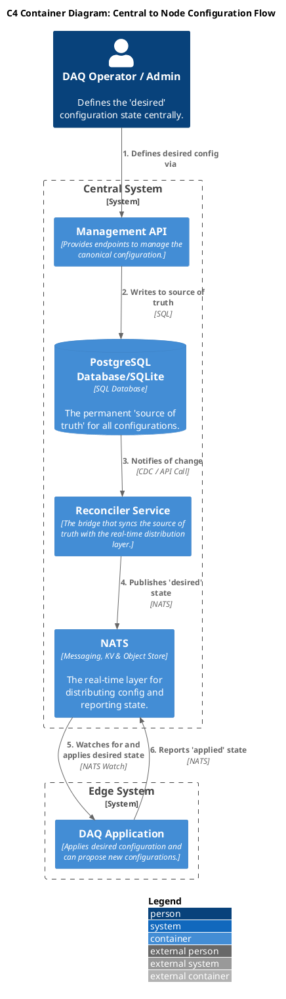
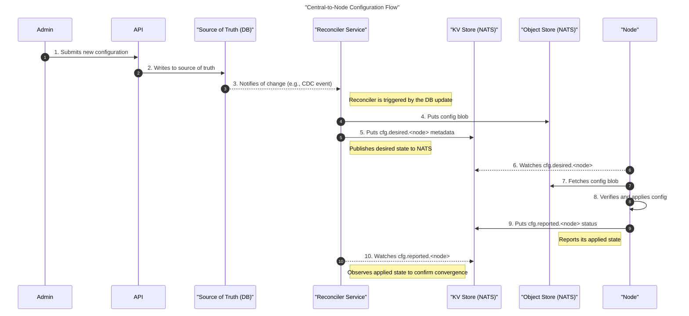

## General Architecture

This diagram shows the top-down flow where an administrator defines a configuration that is pushed to the edge DAQ application.

## Sequence Diagram

This flow describes the proposed method for distributing configuration.

- 	An administrator defines the **desired state** of the system configuration via a `Management API`.

- 	The API transactionally commits this configuration to a persistent datastore (`PostgreSQL`), which serves as the "source of truth".
	
- A change to the database triggers the `Reconciler Service`, either through a Change Data Capture (CDC) mechanism or a direct API call.

- The `Reconciler Service` then publishes this desired state to the NATS messaging and data-streaming platform.

- The `DAQ Application` at the edge, acting as a client, subscribes to these updates, retrieves the new configuration, and applies it to its local environment.

- Finally, the `DAQ Application` provides a feedback loop by reporting its applied state back through NATS, confirming the successful application of the configuration.  

