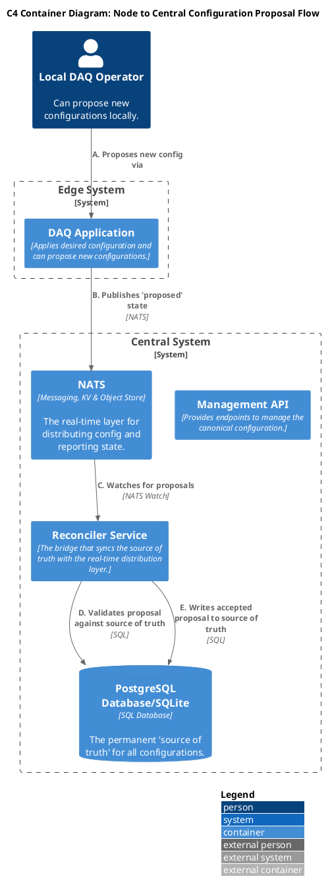
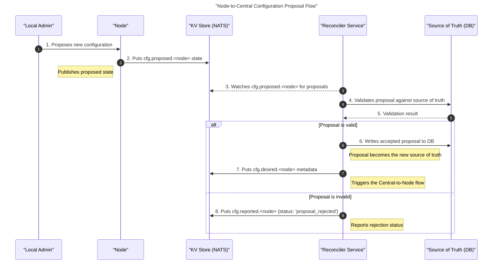

## General Architecture

This diagram shows the "bottom-up" process where a local operator proposes a new configuration. The proposal is sent to the central Reconciler, which validates it against the source of truth (DB). If accepted, the Reconciler promotes it to the new "desired" state, triggering the top-down flow.

## Sequence Diagram

This flow enables controlled, auditable configuration changes to be initiated from the edge.

- A local operator submits a **proposed state** through the local DAQ Application.
- The `DAQ Application` publishes this proposed configuration to the `NATS` platform.
- The central `Reconciler Service`, which monitors for such proposals, consumes the message.
- The Reconciler performs validation logic, comparing the proposal against the current source of truth in `PostgreSQL`.
- If the proposal is deemed valid, the `Reconciler writes` the changes to the PostgreSQL database. This act ratifies the proposal, atomically updating the canonical source of truth.
- This update subsequently triggers the top-down propagation flow, ensuring the newly accepted configuration is consistently distributed across all relevant edge systems.

