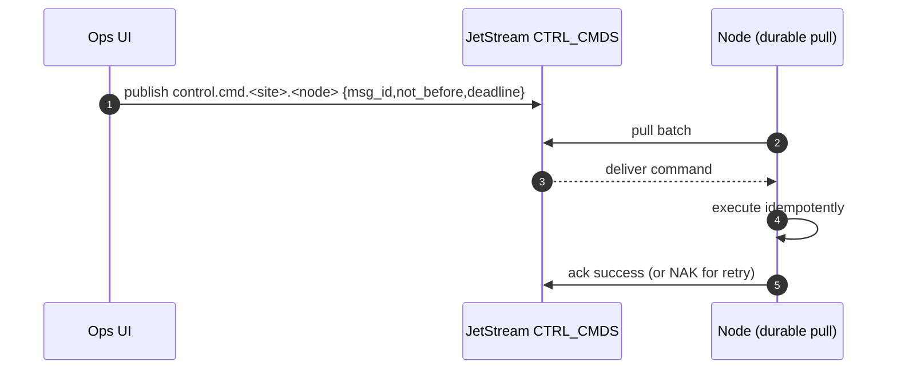

# NATS Durable Command-Reply Pattern

This section describes how to send a command to a specific node (like a server, an IoT device, or a service instance) and guarantee its execution, even if that node is temporarily offline, busy, or restarts.

- An **Operator** (or an automated system) doesn't send a command directly to the node. Instead, it drops the command (a "letter") into the node's specific mailbox on the JetStream server. 
- The **NATS JetStream server** holds onto this letter securely. It doesn't matter if the node is currently online or offline. 
- The **Node**, whenever it's ready and connected, checks its mailbox for new letters. It takes one out, processes it, and then tells the server, "I'm done with this one."

This "store-and-forward" approach makes the system **decoupled and durable**. The sender doesn't need to worry about the state of the receiver.

## NATS Jetstream stream

`control.cmd.<site>.<node>`

It's a persistent log of messages (commands) stored on the JetStream server. The subject name is structured hierarchically for clear routing and targeting.

> **Work-Queue Policy**: This is a crucial setting for the stream. It ensures that even if multiple instances of the same consumer are running (e.g., for high availability), a specific message will be delivered to **only one of them**. This prevents a command like "reboot server" from being executed twice.

## Durable Pull Consumer

This is the mechanism the node uses to read from its mailbox.

- **Durable:** The "durable" part is key. JetStream remembers which messages this specific consumer has already processed. If the node crashes and restarts, it can reconnect with the same durable name and pick up exactly where it left off, without missing commands or reprocessing ones it already acknowledged.

- **Pull:** The "pull" model means the node is in control. It explicitly asks JetStream, "Do you have any work for me?" when it has the capacity to do so. This is highly efficient for clients that may be busy or have intermittent connectivity, as it prevents the server from pushing messages to a client that isn't ready for them (this is called **back-pressure**).

## NATS Command Message Payload

Each command is a message with a specific structure designed for safe execution.

-`msg_id:` A unique identifier for this specific command instance. This is the most critical field for ensuring safety.
- `not_before_ts`: A timestamp specifying the earliest time the command should be executed. This allows for scheduled commands.
- `deadline_ts:` A timestamp specifying when the command expires. If the node receives the command after this deadline, it should discard it. This prevents stale commands from running (e.g., "reboot for maintenance at 2 AM" shouldn't run at 4 AM).
- `expected_node_epoch:` A safety mechanism. An epoch is a unique identifier for a node's "generation" (e.g., its startup time or a boot counter). If the command was issued for an older epoch of the node, the current, newer instance of the node can safely reject it, preventing commands intended for a previous state from running.

## Idempotent Handlers

A software design requirement on the node itself. An operation is **idempotent** if running it multiple times has the same effect as running it just once.

- The system guarantees "at-least-once" delivery. A node could successfully execute a command but crash before it can send the `ack` (acknowledgment) back to the server. When it restarts, JetStream (thinking the command was never processed) will deliver it *again*.

> The handler on the node must first check if the `msg_id` has already been processed (e.g., by looking it up in a local log or database). If it has, the handler simply sends an `ack` and does nothing else. If not, it executes the logic, records the `msg_id` as completed, and then sends the `ack`.

## Diagram Breakdown

### `OPS->>JS: publish ...`:
An operator sends a command. It gets stored securely and durably in the JetStream stream for that specific node. The operator's job is done.

### `NODE->>JS`: pull batch`: 
The node, being a pull consumer, asks the server for a batch of messages when it's ready.

### `JS-->>NODE: deliver command`: 

JetStream delivers the command message. It internally marks this message as "in-flight" and starts an `ack_wait` timer. If it doesn't get an acknowledgment within that time, it will assume the delivery failed and make the message available again.

### `NODE->>NODE: execute idempotently`:

The node's code receives the message. It checks the `msg_id` against its processed list. If it's new, it runs the command logic.

### `NODE->>JS: ack success (or NAK for retry)`:

- **On Success:** The node sends an `ack`. JetStream receives it and permanently deletes the message from the stream. The transaction is complete.
- **On Failure:** The node can send a `nak` (Negative Acknowledgment) to tell JetStream "I failed, but please let me (or another consumer) try again later.

