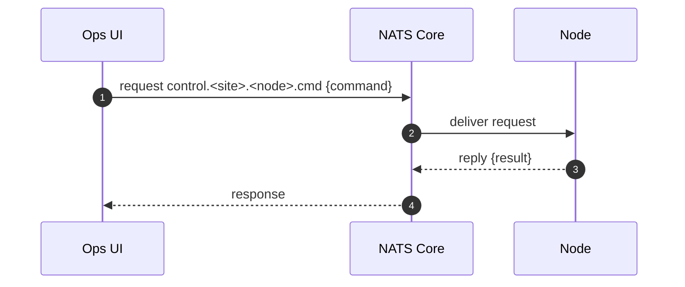

# NATS Transient Command-Reply Pattern

This section describes a transient, request-reply command system. The key concepts are:

- **Transient (Non-persistent)**: This means the command is for "right now." If the target node is not online and listening when the command is sent, the command simply fails (times out). The message isn't stored and delivered later. This is ideal for actions that are only relevant in the present moment, like checking a node's health (ping).
- **Request-Reply:** This is a one-to-one communication pattern. An operator sends a request and waits for a single, direct response from the target node. This is different from a "fire-and-forget" publish where you send a message without expecting a reply.

## NATS Subject

`control.<site>.<node>.cmd`

- **`control`**: A namespace to separate these command messages from other types of traffic (like metrics or logs).
- **`<site>`** : A variable for a logical or physical location (e.g., TS7, MT4A-Track4A).
- **`<node>`**: A variable for the specific node, server, or device ID (e.g., VTI07, cDAQ01).
- **`cmd`**: A literal part of the subject indicating that this is for commands.

Example: A command to ping a specific VTI might be sent to the subject **`control.TS7.VTI03.cmd`**.

## Diagram Breakdown

### OPS -> NATS: Request

- The **Operator's UI** a command-line tool or a NATS Client wants to run a command (e.g., `ping`).
- creates a message payload, which could be JSON like `{"action": "ping"}`.
- uses the NATS client library's `request()` function which: 
	- publishes the message to the target subject (e.g., `control.siteA.node1.cmd)`.- 
	- automatically creates a temporary, unique "inbox" subject and subscribes to it, waiting for the reply. This inbox subject is where the reply should be sent.
- sets a timeout (e.g., 2 seconds). If no reply comes back in time, the request fails.

### NATS -> NODE: Delivery

- The NATS server receives the message on `control.siteA.node1.cmd`.
- sees that the target **Node** has an active subscription to this subject.
- NATS delivers the message to the Node instantly.

### NODE -> NATS: Reply

- The Node's NATS client receives the message. The message includes the special "reply-to" address (the inbox subject created in step 1).
- Node performs the requested action (e.g., executes its internal ping logic).
- sends a reply payload, like `{"status": "ok", "latency": "15ms"}`.
- **publishes this reply** not to the original subject, but directly to the "reply-to" inbox subject that came with the request.

### NATS -> OPS: Response

- The NATS server routes the message from the inbox subject back to the original requester (the **Ops UI** in this case).
- The UI's `request()` function receives the reply, and the program continues, displaying the result to the operator.

## Metadata

In NATS, metadata is handled using **message headers**. This is a distinct part of the message, separate from the subject and the payload (the data). Headers allow you to send contextual information without mixing it into your primary data.

Email analogy:
- **Subject:** The NATS subject (`control.<site>.<node>.cmd`)
- **Body:** The payload (e.g., `{"command": "ping"}`)
- **Headers:** The "To", "From", "Date", and "Subject" lines of the email.

Headers are a collection of key-value pairs, and by convention, headers used by NATS itself start with a Nats- prefix.

In this case:

- `correlation_id`
	- **Purpose**: To track a specific request-reply interaction. This is an ID that **the developer, generates** in its client application (the "Ops UI") before sending the request. It is added to the message headers. The node that receives the request reads this ID from the incoming headers and includes the *exact same ID* in the headers of its reply.
	
> In an asynchronous system, the UI might send multiple commands at once. The `correlation_id` is the only reliable way to match an incoming response to the exact request that initiated it.

- `deadline/ttl (Time To Live)`
	- **Purpose:** To tell the system how long a message or request is valid.
	- **Client-Side Timeout** When a request is made, the NATS client library requires to set a timeout. If a reply isn't received within this window, the request fails. This is the most common way to handle deadlines for transient commands.
	-`Nats-TTL` **Header:** As of NATS Server 2.11, you can set a `Nats-TTL` header on a message being sent to JetStream (the persistence layer). This tells the server to automatically delete the message after the specified time. While this is more for persistent messages, the concept of a "deadline" is fundamental to the client-side timeout in a request-reply scenario.

- `Nats-Msg-Id`

	- **Purpose:** To uniquely identify a message for deduplication. This ID is set by the client application when publishing a message, typically to a JetStream stream. The JetStream server keeps track of the IDs it has seen within a configured "duplicate window." If another message with the same Nats-Msg-Id arrives within that window, it is discarded as a duplicate.  

> For simple, transient request-reply, you might not use this header, as the interaction is a one-off. However, if the command could be accidentally sent twice in quick succession (e.g., a user double-clicks a button), setting this ID could prevent the node from executing the same command twice.

