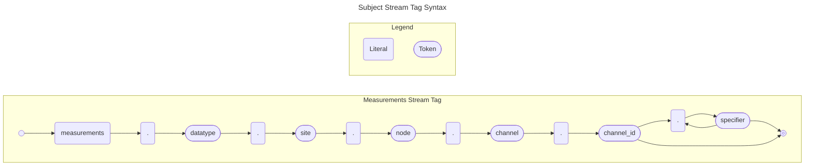
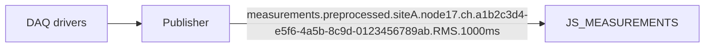

## **Design principle**

Route by stable `channel_id`; keep human-readable names (aliases) in metadata.

- **Measurements (per channel)**  
  `measurements.<site>.<node>.ch.<channel_id>.<metric>.<window_ms>`
  




Breakdown:

- `measurements`: The top-level domain for all meausred data.

- `preprocessed`: A token indicating this is the preprocessed, efficient, grouped data stream direct from the DAQ Node.

- `<site>.<node>`: The physical location hierarchy for broad filtering (e.g., subscribing to all data from one site).

- `ch`: A token indicating this is a granular, individual channel stream.

- `<channel_id>`: The globally unique UUID for the specific data stream.

- `<metric>`: The metric type.

- `<window_ms>`: The time window in milliseconds for which the metric was collected.

## **Example Payload**

```json
{
  "ts": 1693827785123456789,
  "val": 5.2
}
```

- `ts`: The timestamp for the end of the processed metric window.

- `val`: The calculated value for that specific metric.

## **Guidance**
- Keep subject tokens compact (≤ ~16 tokens, < ~256 characters).
- Express units, quality, calibration revision, and TDMS linkage in headers/payload, not in the subject.

## **Pros**

- **Flexible Subscription:** A client (like a real-time UI) can subscribe to exactly the one channel it needs.
- **Simple Payload:** The message is tiny and easy to parse.

## **Cons**

- **Very High Message Rate:** If a device has 48 channels sampling at 1kHz, that's 48,000 messages per second from a single device. This creates significant network and protocol overhead.
- **Loss of Time Correlation:** If you need to correlate the values of channel 1 and channel 2 from the same microsecond, you have to reassemble them in the consumer, which is complex and not guaranteed to be accurate.
- **high-cardinality**: if or when logging directly to a time series database (TSDB), the inclusion of `channel_id` as a core part of the subject hierarchy will likely cause a **high-cardinality** problem.


