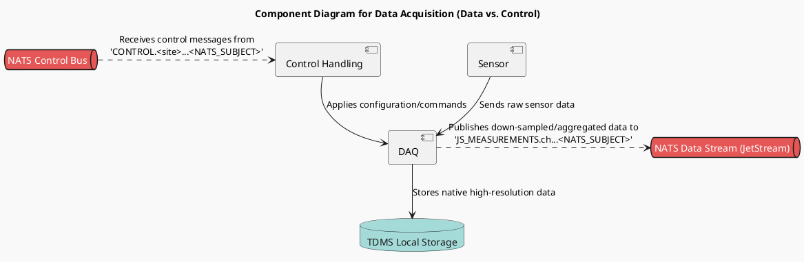

#DAQ Producer Node

In this architecture, the main purveyor of  data is the DAQ Node. It:  

   - Collects sensor data via OPC, Modbus, VISA, DAQMx, MQTT, or custom drivers.
   - Stores native high-resolution data locally using TDMS.
   - Publishes down-sampled/aggregated data to NATS JetStream subjects (e.g., `JS_MEASUREMENTS.ch.<channel_id>.<metric>.<window_ms>`).
   - Subscribes to control/config messages via NATS (e.g., `CONTROL.<site>.<node>.device.<device_id>.*` or. `CONTROL.<site>.*`)
   
   

