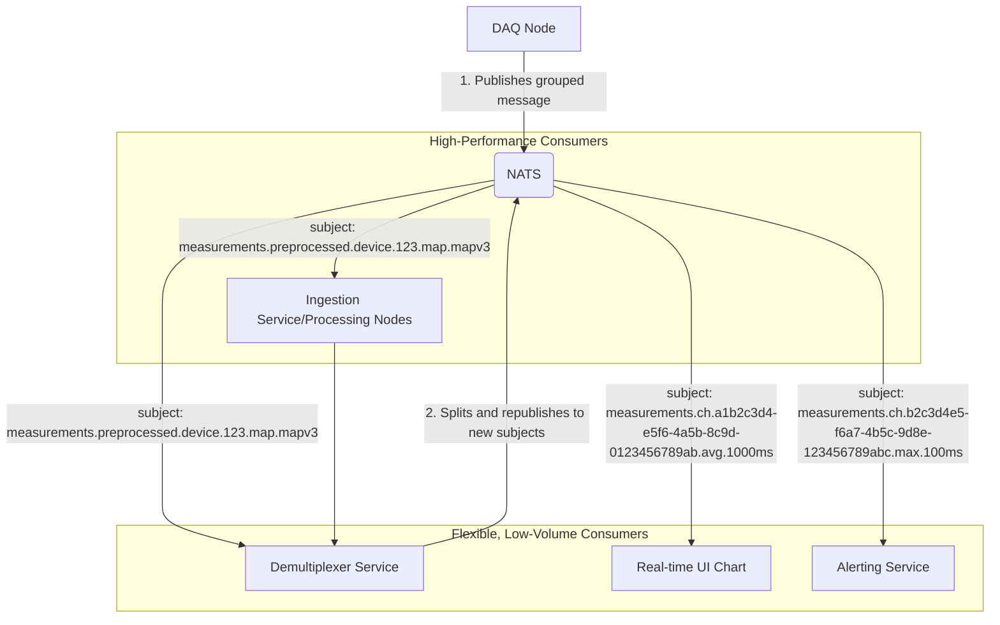

- **Publish Grouped Data:** the DAQ node publishes the efficient, time-correlated **grouped messages** to a subject like `measurements.preprocessed.site.node.device.<device_id>`.

- Use a **"Demultiplexer" Service:** create a small, dedicated NATS service that subscribes to the grouped stream (`measurements.preprocessed....>`). Its only job is to receive each grouped message, break it apart, and republish the data as **per-channel messages** on subjects like `measurements.ch.<channel_id>.map.<map_version>`.

This gives all the potential consumers a choice.

- **Heavy-duty consumers** like an ingestion service subscribe to the efficient `measurements.preprocessed...` stream.

- **Lightweight consumers** like a single UI chart or a simple alert subscribe to the granular `measurements.ch...` stream.

