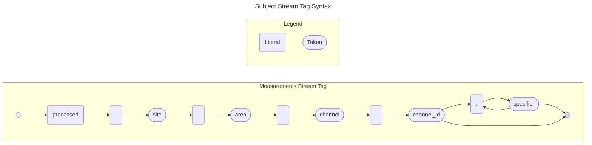

## **Design principle**

Route by stable `channel_id`; keep human-readable names (aliases) in metadata.

- **Processed/derived (per channel)**  
  `processed.<site>.<area>.<pipeline>.ch.<channel_id>.<calc>`

