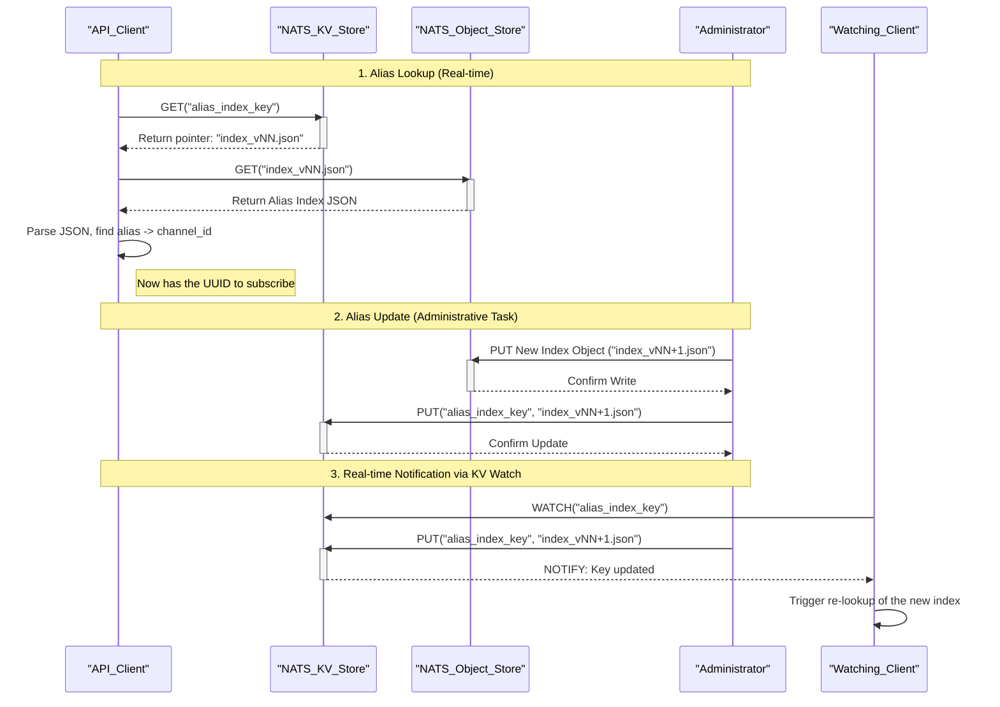

# Alias Management

**Objective:** provide human-friendly names to the channels without affecting routing or history.

## Source of truth SQL Table

the PostgreSQL database becomes the canonical, permanent home for all Metadata. This is where the "true" state of the system is defined.

the following standard relational tables for your metadata would be created:

```SQL  
CREATE TABLE channel_aliases (
    channel_id  UUID         PRIMARY KEY,
    alias       TEXT         NOT NULL,
    site        TEXT,
    metadata    JSONB, -- For flexible, unstructured configuration
    last_updated TIMESTAMPTZ DEFAULT now(),
    CONSTRAINT  alias_site_unique UNIQUE(alias, site)
);
```

* **Transactional Integrity (ACID)**: Changes are safe and reliable.

* **Rich Querying &**`JOIN`**s**: run powerful analytical queries by joining your time-series data with your metadata: `SELECT ... FROM telemetry JOIN channel_aliases ON ....`

* **Single Source of Truth:** no ambiguity about where the correct configuration is stored.

* **Mature Tooling:** Leverage vast ecosystem of tools for database administration, backup, and security.


## Use of NATS JetStream Features

### NATS KV Store for Pointers:

The Key-Value store can store the "current version" pointer. KV operations are extremely fast and atomic, making it an adapted tool for the frequent lookups the UI/API will perform to find the active index.  
  

### NATS Object Store for Snapshots:  

The Object Store is designed for storing larger, versioned blobs of data, such as JSON index files. This provides built-in audit trail (`vNN.json` for eg.) and allows to roll back to a previous version of the alias index if needed, simply by updating the KV pointer.

## Scoped and Hierarchical Resolution

The **`node → site → global`** resolution can potentially solve common operational problems by allowing for context-specific naming. For example:

* An alias like **"Primary_Sensor"** can point to `uuid-123` on `node-A` but point to `uuid-456` on node-B.
* A site-level alias like **"Main_Power_Feed"** can be defined once for an entire site, while a global alias like **"Master_Clock"** can be used everywhere.  
This prevents name collisions and makes the system more intuitive for operators

## Atomic Updates and Change Control
The two-step update process (first, write the new `alias-index/.../vNN.json` object, then update the KV pointer) ensures that consumers are never exposed to a partially written or inconsistent state. Clients will only switch to the new index version when fully available, making  updates safe and atomic from a consumer's perspective.

## Client-Side Caching and Updates

The client should place a watch on the KV key (`schema.alias_index.<scope>...`). NATS will then proactively notify the client the instant the pointer changes. This allows the UI to refresh its internal cache immediately, providing a much more responsive experience.
> :warning:  alias index JSON file size for parsing    

## Sequence Diagram



- **Participants:**
	- **API Client:** The application that needs to resolve an alias (e.g., a dashboard).
	- **NATS KV Store:** Stores the "pointer" to the currently active alias index file.
	- **NATS Object Store:** Stores the actual alias index files (JSON), providing versioning.
	- **Administrator:** The user or automated process responsible for updating aliases.

- **Lookup Flow:** The client first performs a very fast lookup in the KV Store to find out which version of the alias index is currently active. It then fetches that specific version from the Object Store and finds the channel_id.

- **Update Flow:** To update the aliases, an administrator first uploads the new index file to the Object Store. Only after that file is successfully stored do they atomically update the pointer in the KV Store. This ensures there is no downtime and clients never see a partially updated or broken index