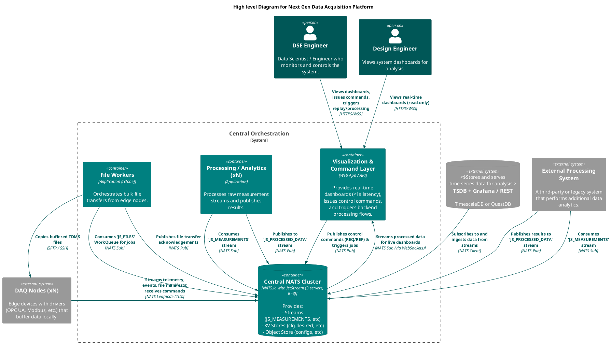

```puml
@startuml
!include <C4/C4_Container>

'=====================================================
' Theme Definition
'=====================================================
' Custom Teal Colors
!define TEAL_LIGHT  #E0FFFF
!define TEAL_MEDIUM #008080
!define TEAL_DARK   #005757
!define TEAL_BORDER #004040
!define TEAL_TEXT   #FFFFFF

' CORRECTED: Use UpdateElementStyle macro for C4 elements
UpdateElementStyle("Person", $bgColor=TEAL_DARK, $borderColor=TEAL_BORDER, $fontColor=TEAL_TEXT)
UpdateElementStyle("System_Ext", $bgColor=TEAL_DARK, $borderColor=TEAL_BORDER, $fontColor=TEAL_TEXT)
UpdateElementStyle("SystemDb_Ext", $bgColor=TEAL_DARK, $borderColor=TEAL_BORDER, $fontColor=TEAL_TEXT)
UpdateElementStyle("Container", $bgColor=TEAL_MEDIUM, $borderColor=TEAL_DARK, $fontColor=TEAL_TEXT)
UpdateElementStyle("ContainerDb", $bgColor=TEAL_MEDIUM, $borderColor=TEAL_DARK, $fontColor=TEAL_TEXT)

' Use regular skinparam for non-C4 elements
skinparam {
  shadowing false
}

skinparam SystemBoundary {
  BackgroundColor #F0F8FF
  BorderColor TEAL_BORDER
  FontColor TEAL_DARK
}

skinparam Arrow {
  Color TEAL_DARK
  FontColor TEAL_DARK
}
'=====================================================

title "High level Diagram for Next Gen Data Acquisition Platform"

' -------------------
' Actors & External Systems
' -------------------
Person(dse, "DSE Engineer", "Data Scientist / Engineer who monitors and controls the system.")
Person(design_eng, "Design Engineer", "Views system dashboards for analysis.")

System_Ext(daq_nodes, "DAQ Nodes (xN)", "Edge devices with drivers (OPC UA, Modbus, etc.) that buffer data locally.")
SystemDb_Ext(tsdb, "TSDB + Grafana / REST", "TimescaleDB or QuestDB", "Stores and serves time-series data for analysis.")
System_Ext(ext_proc, "External Processing System", "A third-party or legacy system that performs additional data analytics.")

' -------------------
' System Boundary
' -------------------

System_Boundary(c1, "Central Orchestration") {

    Container(vis_cmd, "Visualization & Command Layer", "Web App / API", "Provides real-time dashboards (<1s latency), issues control commands, and triggers backend processing flows.")
    Container(processing, "Processing / Analytics (xN)", "Application", "Processes raw measurement streams and publishes results.")
    Container(file_worker, "File Workers", "Application (rclone)", "Orchestrates bulk file transfers from edge nodes.")

    ContainerDb(nats_js, "Central NATS Cluster", "NATS.io with JetStream (3 servers, R=3)", "Provides:\n- Streams (JS_MEASUREMENTS, etc)\n- KV Stores (cfg.desired, etc)\n- Object Store (configs, etc)")

}

' -------------------
' Relationships
' -------------------

' User -> UI
Rel(dse, vis_cmd, "Views dashboards, issues commands, triggers replay/processing", "HTTPS/WSS")
Rel(design_eng, vis_cmd, "Views real-time dashboards (read-only)", "HTTPS/WSS")

' UI <-> NATS
Rel(vis_cmd, nats_js, "Publishes control commands (REQ/REP) & triggers jobs", "NATS Pub")
Rel(nats_js, vis_cmd, "Streams processed data for live dashboards", "NATS Sub (via WebSockets)")

' DAQ Nodes -> Central Platform
Rel(daq_nodes, nats_js, "Streams telemetry, events, file manifests; receives commands", "NATS Leafnode (TLS)")

' Internal Processing App <-> NATS
Rel(processing, nats_js, "Consumes 'JS_MEASUREMENTS' stream", "NATS Sub")
Rel(processing, nats_js, "Publishes to 'JS_PROCESSED_DATA' stream", "NATS Pub")

' External Processing System <-> NATS
Rel(ext_proc, nats_js, "Consumes 'JS_MEASUREMENTS' stream", "NATS Sub")
Rel(ext_proc, nats_js, "Publishes results to 'JS_PROCESSED_DATA' stream", "NATS Pub")

' File Worker <-> NATS & DAQ Nodes
Rel(file_worker, nats_js, "Consumes 'JS_FILES' WorkQueue for jobs", "NATS Sub")
Rel(file_worker, daq_nodes, "Copies buffered TDMS files", "SFTP / SSH")
Rel(file_worker, nats_js, "Publishes file transfer acknowledgements", "NATS Pub")

' TSDB <-> NATS
Rel(tsdb, nats_js, "Subscribes to and ingests data from streams", "NATS Client")

@enduml
```
