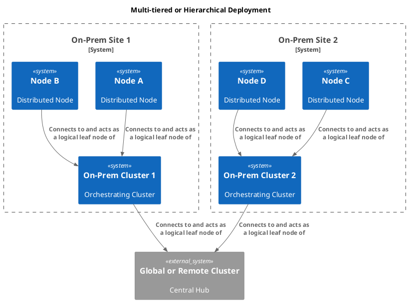

The system will use a multi-layered topology, creating a communication chain where each layer collects data from the level below it and passes it to the level above, all the way to the core.
Each tier in the hierarchy acts as a collection point, or hub, for the tier beneath it.



## Distributed Nodes as Leaf Node

At the lowest level, individual  nodes (DAQ  and/or distributed nodes) connect as leaf nodes to the local on-prem Orchestrating cluster. This is the ideal use case for leaf nodes, as it allows a large number of lightweight clients to connect to a nearby server without requiring them to be full members of the cluster. Messages from these devices can be handled and processed locally, and only relevant, filtered data is forwarded up the chain.

```embed
url:            https://docs.nats.io/running-a-nats-service/configuration/leafnodes
name:           Running a NATS service/Configuring NATS Server/Leafnodes
desc:           A Leaf Node extends an existing NATS system of any size, optionally bridging both operator and security domains. A leafnode server will transparently route messages as needed from local clients to one or more remote NATS system(s) and vice versa. The leaf node authenticates and authorizes clients using a local policy. Messages are allowed to flow to the cluster or into the leaf node based on leaf node connection permissions of either.
image:          https://hub.docker.com/api/media/repos_logo/v1/library%2Fnats?type=logo
favicon:        https://github.com/Aetherinox/mkdocs-link-embeds/assets/118329232/13a151b1-d7f9-4e27-909b-a26986ab0954
favicon_size:   25
target:         new
accent:         4C59BFE0
```


## On-Prem/Site Cluster as a Leaf Node

The entire on-prem Orchestration cluster then acts as a single, logical leaf node of the global cluster. This allows the local on-prem system to be an independent entity, handling its own internal communication, while also being able to publish and subscribe to a select set of subjects on the wider global network. This approach provides strong isolation and fault tolerance; if the connection to the global cluster is lost, the on-prem system and its connected to its nodes and can continue to function normally.

## Global or Remote Cluster

This top-level cluster serves as the central hub for all connected on-prem site or plant systems. It handles the routing of data between different regional or local clusters, enabling a global view and communication across the entire network.

```embed
url:            https://docs.nats.io/running-a-nats-service/configuration/clustering
name:           Running a NATS service/Configuring NATS Server/Clustering
desc:           NATS supports running each server in clustered mode. You can cluster servers together for high volume messaging systems and resiliency and high availability.
image:          https://hub.docker.com/api/media/repos_logo/v1/library%2Fnats?type=logo
favicon:        https://github.com/Aetherinox/mkdocs-link-embeds/assets/118329232/13a151b1-d7f9-4e27-909b-a26986ab0954
favicon_size:   25
target:         new
accent:         4C59BFE0
```
---

This tiered architecture is highly effective because it provides:

- **Scalability:** You can easily add more local clusters and devices without overloading the remote global cluster.

- **Resilience:**  Each tier is self-contained. If a connection fails, only that part of the network is affected, ensuring local operations remain uninterrupted.

- **Reduced Latency:** Messages between Nodes and local services are handled by the nearest On-Prem/Site cluster, minimizing network round-trips.

- **Security** This model allows for clear segregation of data. You can control which subjects are shared between tiers, preventing unwanted data from being propagated globally.
